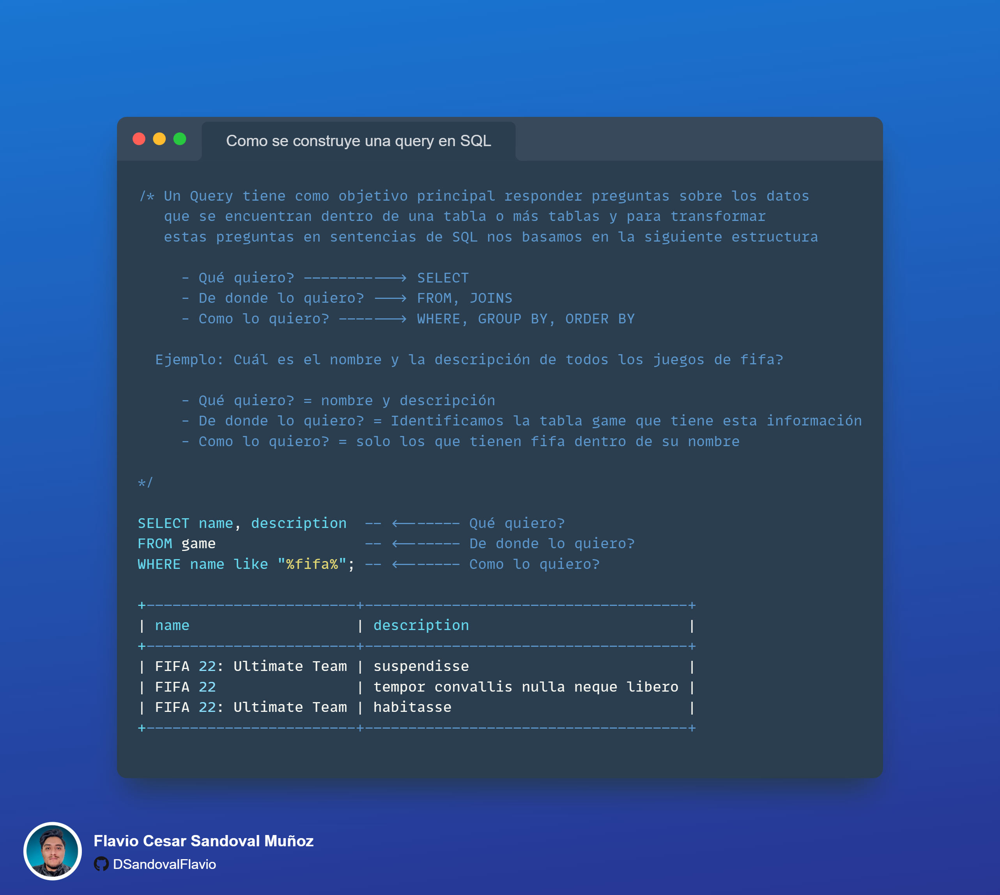
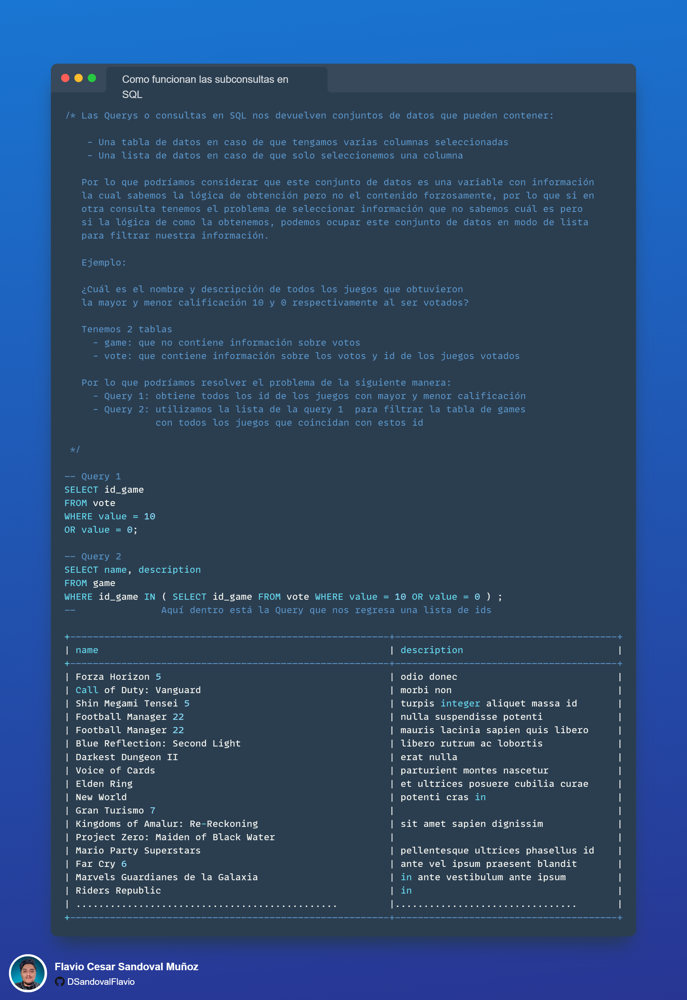

# Primer Sprint

## Presentación

Hola, mi nombre es Flavio Sandoval. Bienvenido nuevamente a este espectacular reto. Soy el líder de este proyecto y te contaré un poco sobre lo que realizaremos en esta primera entrega del proyecto.

## ¿Qué es un Sprint?

Un sprint es un periodo de tiempo en el que se realizan actividades para lograr un objetivo. Esta modalidad de trabajo es muy utilizada en el mundo del desarrollo de software. Nos permite hacer pequeñas entregas de valor y al final, las entregas acumuladas nos permiten lograr un objetivo mayor.

A continuación, te proporciono información útil para que puedas entender un poco más cómo se resolverá este primer entregable:

- Duración del Sprint: 1 Semana
- Herramientas a Utilizar: SQL
- Link Data: [Supertienda | Kaggle](https://www.kaggle.com/datasets/flaviocesarsandoval/supertienda)
- Link Curso SQL: [Curso SQL](https://www.sololearn.com/learning/1060)
- Instalación de MySQL: [Instalacion MySQL Windows](https://www.youtube.com/watch?v=Cz3ROw_93yY)
- Instalación de MySQL: [Instalacion MySQL Mac](hhttps://www.youtube.com/watch?v=BHEe1j4Jevs&t=434s)

---
## Introduccion

En este proyecto, vamos a actualizar el antiguo sistema de registro de ventas de la empresa, que actualmente se encuentra obsoleto, por una base de datos relacional. Para ello, nos compartieron un archivo CSV con todas las ventas realizadas en la empresa, y vamos a utilizar MySQL, una base de datos relacional de código abierto que nos permitirá almacenar y consultar los datos de manera eficiente.

Tendremos que llevar a cabo varias tareas para lograr este objetivo, pero para empezar, el equipo de negocio nos ha solicitado que analicemos los datos que tenemos actualmente para entender mejor la información que tenemos y poder tomar mejores decisiones en el futuro.

Por lo tanto, nos han solicitado que les ayudemos a responder las siguientes preguntas:

- ¿Cuál es el total de ventas para cada año registrado?
- ¿Cuántos productos se vendieron en cada año?
- ¿Cuál es la región que más vendió en el último año?
- ¿Cuáles son los 5 productos más vendidos durante los últimos 2 años?
- ¿Cuál es la categoría con más ventas en general?
- ¿Quiénes son los 5 mejores clientes de los ultimos 2 años?
- ¿Cuáles son los 10 productos más comprados por nuestros 3 principales clientes?

Para resolver estas preguntas, vamos a utilizar SQL, un lenguaje de consulta estructurado que nos permitirá consultar los datos de manera eficiente. Por lo que tendrás que instalar MySQL en tu computador. Por el momento, vamos a crear una sola tabla y ahí vamos a cargar los datos que tenemos actualmente en el archivo CSV.

Link Data: [Supertienda | Kaggle](https://www.kaggle.com/datasets/flaviocesarsandoval/supertienda)

Cuando tengas todo listo, puedes compartir tu solución utilizando los hashtags #Datosalamexicana y #RetoDatosalamexicanaStore en LinkedIn o Twitter.

Si no sabes cómo instalar MySQL, te dejo un video de cómo hacerlo en Windows y otro en Mac, también te dejo un curso de SQL para que puedas aprender a utilizarlo.

Si necesitas más ayuda te dejo lo siguiente:

- Un resumen muy corto de que es [SQL](IntroSQL.md).
- La solución de este [Reto](Solucion-Primer-Sprint.md).

Te dejo estas imágenes para que puedas ver la mejor manera de resolver las preguntas utilizando SQL.

Te quisiera adelantar que el siguiente Sprint será muy interesante, ya que vamos a empezar a modelar la información y a crear las tablas que necesitamos para poder almacenar los datos de manera eficiente. Estos son conceptos más relacionados con bases de datos, pero no te preocupes, te daremos todo el soporte que necesites.

---

Puedes dirigirte a las siguientes páginas para continuar en tu segundo sprint

- [Home](README.md)
- [Segundo Sprint](Segundo-Sprint.md)

---

Al finalizar el Sprint, puedes comentar tu solucion utilizando los hashtag #Datosalamexicana y #RetoDatosalamexicanaStore en LinkedIn o Twitter.

Tambien deberias de haber aprendido lo siguiente

- Instalar MySQL
- Crear una base de datos
- Crear una tabla
- Cargar datos a una tabla
- Realizar consultas SQL