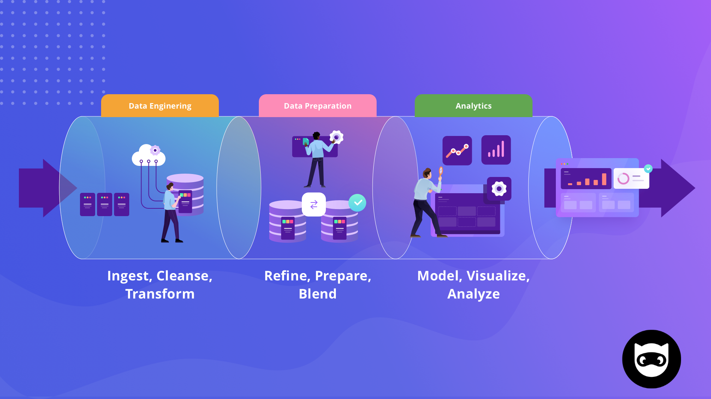

# Datos a la Mexicana Store

Estas buscando convertirte en Data Analyst o Data Engineer? ¿Quieres aprender sobre bases de datos, SQL, Python, ETL, Tableau, Streamlit, etc.? ¿Quieres aprender de manera práctica y con un proyecto? ¡Entonces este es el lugar indicado!

## Objetivo

El objetivo de este proyecto es que puedas obtener un aprendizaje duradero, es decir, que puedas aprender de manera práctica y que puedas aplicar tus conocimientos en un proyecto similar al que te encontrarías en un trabajo real. La duración ideal de este proyecto es de 4 meses, pero puedes hacerlo a tu ritmo. Si quieres recibir el pago del aprendizaje duradero, te invitamos a participar en este mini proyecto.

## ¿Qué es el aprendizaje duradero?

El aprendizaje duradero se refiere a la capacidad de aplicar los conocimientos adquiridos en un proyecto real. Este concepto se ha vuelto muy popular en los últimos años, ya que se ha demostrado que la mejor forma de aprender es a través de la práctica. Por lo tanto, el aprendizaje duradero es una forma de aprender que se basa en la práctica y la aplicación de los conocimientos adquiridos en un proyecto real.

## ¿Por qué Datos a la Mexicana Store?

Datos a la mexicana Store es un proyecto muy similar al último que realice en la empresa en la que trabajé, por lo que es muy similar a cómo lo harías en una empresa. Además, es un proyecto muy completo, ya que abarca desde la extracción de datos hasta la creación de un dashboard.

## ¿Qué necesito para participar?

Este proyecto está enfocado en personas que quieran aprender sobre las bases del proceso "end to end" de un proyecto de data. Por lo tanto, podrás aprender aunque no tengas conocimientos previos. Sin embargo, si ya tienes conocimientos previos, este proyecto te ayudará a reforzarlos y a aplicarlos en un proyecto real.

Los requisitos para participar son:

- Una computadora con Windows, Mac o Linux
- Saber Excel
- Completar el registro en el siguiente link: [https://forms.gle/qETovpFn2RqDmNPA8](https://forms.gle/qETovpFn2RqDmNPA8)
- Utilizar los hashtag #Datosalamexicana y #RetoDatosalamexicanaStore en tus publicaciones de Twitter o LinkedIn donde menciones este proyecto.
- Enviar el proyecto final con todos los entregables cumplidos a la siguiente dirección de correo: (proximamente disponible)

Eso es todo, si cumples con los requisitos, puedes participar en este proyecto.

Tendras que completar los siguientes pasos:

- [Bienvenida a la empresa (Ficticia) e introducción al proyecto](Bienvenida-Introduccion.md)
- [Primer Sprint(1 semana) SQL](/Primer-Sprint/Primer-Sprint.md)
- [Segundo Sprint(2 semanas) Bases de Datos](Segundo-Sprint.md)
- [Tercer Sprint(4 semanas) Python - Pandas](Tercer-Sprint.md) "Proximamente"
- [Cuarto Sprint(2 semanas) Git](Cuarto-Sprint.md) "Proximamente"
- [Quinto Sprint(1 semana) Python - Streamlit](Quinto-Sprint.md) "Proximamente"
- [Sexto Sprint(2 semana) Python - ETL](Sexto-Sprint.md) "Proximamente"
- [Septimo Sprint(2 semanas) Tableau](Septimo-Sprint.md) "Proximamente"
- [Octavo Sprint(2 semanas) Python - Dashboard](Octavo-Sprint.md) "Proximamente"

## Que es un Data Analyst Engineer?

Data Analyst Engineer es como yo denomino a la persona que posee conocimientos tanto de Analista de Datos como de Ingeniero de Datos. Considero que esta combinación de conocimientos es muy importante, ya que he observado que muchas vacantes laborales requieren siempre un poco de ambos conocimientos.

---

## ¿Quieres saber más sobre mí?

Mi nombre es Flavio César Sandoval y soy Data Engineer. Actualmente trabajo en una empresa de tecnología en México. Me encanta aprender y enseñar, por lo que me gusta compartir mis conocimientos en mi blog [https://dsandovalflavio.com/](https://dsandovalflavio.com/). Si quieres saber mas sobre mi, puedes visitar mi perfil de LinkedIn [https://www.linkedin.com/in/flaviocesarsandoval/](https://www.linkedin.com/in/flaviocesarsandoval/) o en Twitter [https://twitter.com/dsandovalflavio](https://twitter.com/dsandovalflavio)

Si quieres seguir este proyecto con mentorias y cursos, puedes mandarme un mensaje por LinkedIn o Twitter y con gusto te cuento mas sobre costos y fechas.
